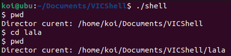
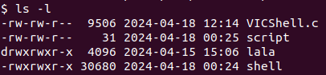
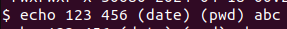
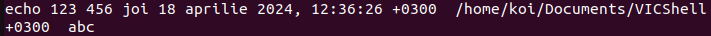
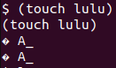
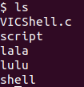
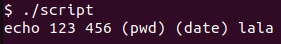
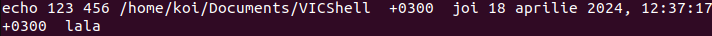

# VICShell 🖥️

VICShell is a custom command-line interface designed to provide a unique and flexible shell experience. It's built from the ground up to support complex command parsing, script execution, and an array of built-in commands that enhance user interaction with the operating system.

Features 🌟

VICShell offers a range of features that cater to various shell operations and script execution:

* Command Execution: Execute common shell commands directly from your custom interface.
* Script Execution: Run scripts from file with the ability to pass arguments and handle complex command nesting.
* Nested Commands: Supports commands within commands using parentheses ( ) for complex operations.
* Internal Commands: Includes built-in commands like cd, pwd, and ls with options.

Usage 📖

Here are some basic examples of how to use VICShell:
1. Print working directory: pwd
2. Change directory: cd path

3. List directories and files: ls -l -a

   
4. Execute other shell commands that are called externally, theese commands can be nested

   
5. Execute scripts: ./myscript

Script execution details:

VICShell supports the execution of scripts directly from the command line. Scripts intended for VICShell can include any commands that the shell is capable of parsing and executing. This feature allows you to automate tasks and extend the functionality of the shell by writing scripts that perform complex operations or series of commands.

Contributing 🤝
We welcome contributions to VICShell! If you have suggestions for improvements or new features, feel free to make a pull request or open an issue.

About the Project 📚
VICShell was created as an educational project to understand the intricacies of shell programming and process management in Unix-like systems.
